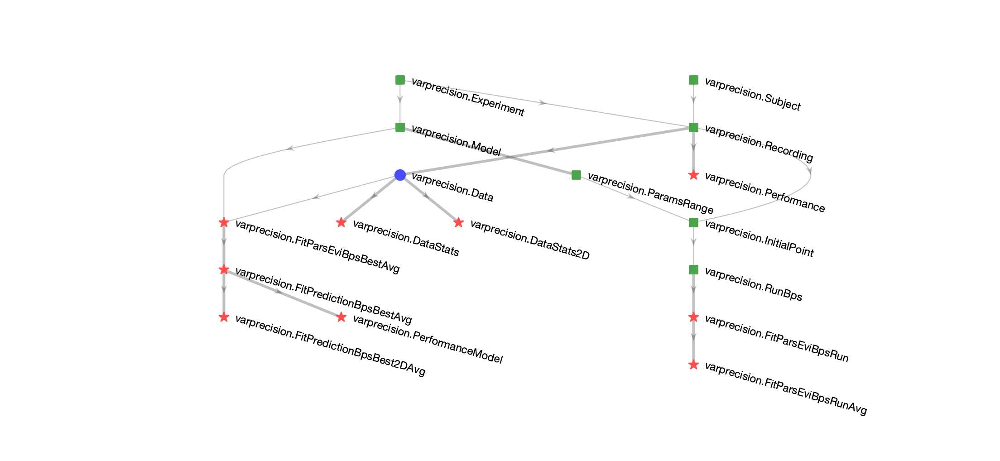

# Variable Precision

This repository contains the DataJoint pipeline for the publication Shen and Ma, 2019

Link to the publication: https://psycnet.apa.org/record/2018-51674-001

This repository used DataJoint Matlab to implement the data pipeline, for an introduction to DataJoint, please visit https://datajoint.io/

Here is the Diagram of the data pipeline, containing the major tables used in this pipeline.

* Tables corresponding to the experiments and behavioral data and statiscis: `Experiment`, `Subject`, `Recording`, `Data`, `DataStats`, `DataStats2D`, `Performance`.

* Tables corresponding to the model and model fits: `Model`, `InitialPoints`, `ParameterRange`, `RunBps`, `FitParsEvi*`, `FitPrediction*`.

* Green squares are manual tables, blue dots are imported tables, red stars are computed tables.

The code that define the above tables and their computations is in the package `+varprecision`.

The orignal behavioral data was stored in the directory `VP_data/`.

Decision rules used in this publication are in the directory `+varprecision/+decisionrule_bps`.

Directory `scripts/` provides scripts that help run the data pipeline.

Directory `utils/` provides some utility functions used in this project.

Directory `+varprecision/+plots` provides some plotting functions.
